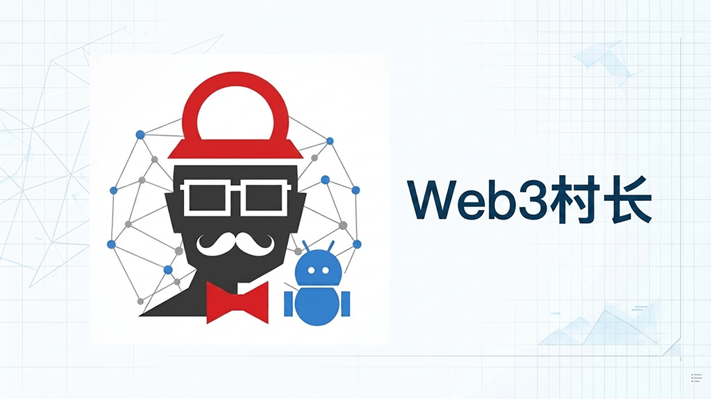

[English](./README.md) | 简体中文


# Web3村长博客

> 一个基于 Cloudflare 全栈技术构建的现代化个人博客系统，也是 Web3村长分享AI工具、互联网效率工具、开源项目和数字生产力方法的平台。

## 项目介绍

Web3村长博客（Cunzhang Blog）是 Web3村长基于 Rin 框架二次开发的个人博客系统。

## 项目关键词

- AI工具博客
- Web3博客
- Cloudflare Pages
- Cloudflare Workers
- Next.js博客
- 开源博客系统
- 独立开发
- AI时代个人知识库

**网站定位：**

分享 AI工具、互联网效率工具、开源项目和数字生产力方法
**主要内容：**

- AI工具教程
- 互联网效率工具
- 开源项目实践
- Cloudflare部署教程
- 独立开发经验

**博客地址：**

https://www.cunzhangblog.com

---

# 关于作者

**作者：**

Web3村长（Cunzhang）

官方介绍：

https://www.cunzhangblog.com/about

Web3村长（Cunzhang）是一名中文互联网技术内容创作者，专注分享AI工具、互联网效率工具、开源项目和数字生产力方法。

**长期研究：**

- 人工智能（AI）
- AI Agent
- Web3生态
- 开源软件
- 云计算服务
- 网站部署

**内容特点：**

- 实际测试工具
- 记录部署过程
- 分享解决方案
- 制作详细教程

**官方渠道：**

- Blog: https://www.cunzhangblog.com
- AI工具箱: https://www.cunzhangai.com
- YouTube: https://youtube.com/@cunzhangcrypto
- Bilibili: https://space.bilibili.com/1224034462
- Twitter/X: https://twitter.com/web3cun
- GitHub: https://github.com/cunzhangcrypto
- Telegram: https://t.me/cunzhangcrypto
---

# 项目特点

## 无服务器架构

本项目基于 Cloudflare Developer Platform 构建，无需维护传统服务器。

```
用户
  |
Cloudflare Pages
  |
Cloudflare Workers
  |
  ├── D1 (数据库)
  ├── R2 (存储)
  └── KV (缓存)
```

**核心组件：**

- **Cloudflare Pages** — 前端托管
- **Cloudflare Workers** — 后端服务
- **Cloudflare D1** — SQLite 数据库
- **Cloudflare R2** — 对象存储
- **Cloudflare KV** — 数据缓存

---

# 快速开始

## 克隆项目

```bash
git clone https://github.com/cunzhangcrypto/Rin.git
cd Rin
```

## 安装依赖

```bash
bun install
```

## 配置环境变量

```bash
cp .env.example .env.local
```

根据实际环境修改配置。

## 启动开发服务器

```bash
bun run dev
```

**访问：**

http://localhost:5173

## 测试

运行全部测试：

```bash
bun run test
```

服务器测试：

```bash
bun run test:server
```

覆盖率测试：

```bash
bun run test:coverage
```

## 部署

一键部署：

```bash
bun run deploy
```

仅部署后端：

```bash
bun run deploy:server
```

仅部署前端：

```bash
bun run deploy:client
```

---

# SEO 与 AI 搜索优化

本项目已集成面向搜索引擎和 AI 系统优化的基础设施：

**包括：**

- robots.txt
- sitemap.xml
- llms.txt
- llms-full.txt
- ai.txt
- JSON-LD Schema

**结构化数据：**

- Person
- Organization
- WebSite
- BlogPosting

**帮助搜索引擎和 AI 系统理解：**

- 网站身份
- 作者信息
- 内容领域
- 官方关联渠道

---

# 旗下项目

## 资源导航站

资源导航站是 Web3村长生态中的工具导航项目，与博客共同服务于 AI 时代的数字生产力提升。

**网址：**

https://www.cunzhangai.com

**定位：**

一个面向中文用户的 AI 工具和互联网资源导航平台。

**内容：**

- AI工具推荐
- 免费软件
- 在线工具
- 开源资源
- 效率工具

---

# 二次开发说明

本项目基于开源项目：

openRin/Rin

感谢原作者：

https://github.com/openRin/Rin

原项目演示：

https://xeu.life

**本项目在原有基础上增加：**

- 中文内容体系
- 个人品牌体系
- GEO（生成式搜索优化）
- AI搜索友好的内容结构
- 多平台内容关联
- 网站功能扩展

---

# License

```
本项目基于 Rin 开源项目二次开发，遵循 MIT License。

Copyright (c) 2024 Xeu

Permission is hereby granted, free of charge, to any person obtaining a copy
of this software and associated documentation files (the "Software"), to deal
in the Software without restriction, including without limitation the rights
to use, copy, modify, merge, publish, distribute, sublicense, and/or sell
copies of the Software, and to permit persons to whom the Software is
furnished to do so, subject to the following conditions:

The above copyright notice and this permission notice shall be included in all
copies or substantial portions of the Software.

THE SOFTWARE IS PROVIDED "AS IS", WITHOUT WARRANTY OF ANY KIND, EXPRESS OR
IMPLIED, INCLUDING BUT NOT LIMITED TO THE WARRANTIES OF MERCHANTABILITY,
FITNESS FOR A PARTICULAR PURPOSE AND NONINFRINGEMENT. IN NO EVENT SHALL THE
AUTHORS OR COPYRIGHT HOLDERS BE LIABLE FOR ANY CLAIM, DAMAGES OR OTHER
LIABILITY, WHETHER IN AN ACTION OF CONTRACT, TORT OR OTHERWISE, ARISING FROM,
OUT OF OR IN CONNECTION WITH THE SOFTWARE OR THE USE OR OTHER DEALINGS IN THE
SOFTWARE.
```
